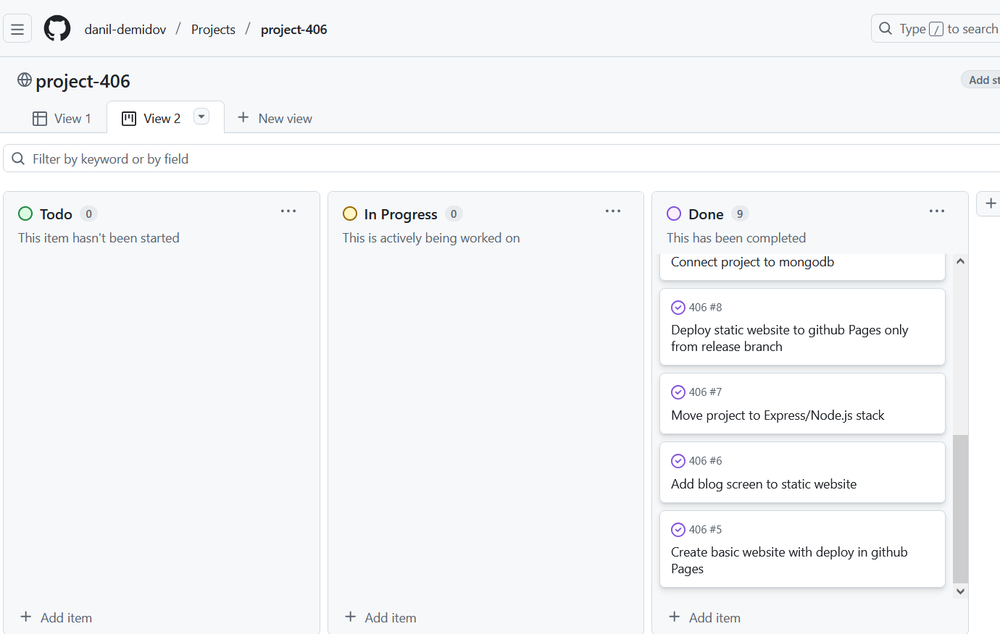

# Руководство по организации командного проекта на GitHub

## ЛР 1: Планирование и инициализация (Inception)

### 1. Создание репозитория и клонирование на локальные машины
- тимлид создал репозиторий 
- добавил участников в качестве contributors
- участники склонировали репозиторий по SSH 

### 2. Создание README.md: описание проекта, его цели, стека технологий
- создали readme с описанием участников и названем проекта 

### 3. Создание доски проекта (GitHub Projects или Trello)
- создали проект
- добавили представление канбан 
- добавили следующие столбцы
	- **To Do**: 
	- **In Progress**:
	- **Done**: 

### 4. Создание бэклога продукта: мозговой штурм и разбиение проекта на мелкие задачи (Issues/USER STORIES)
- разбили проект на следующие этапы 
	- Модификация операций с постами (удаление, обновление)
	- Создание контроллера комментариев (CRUD)
	- Разделение формы поста и экрана создания поста (для комментариев)
	- БАГ: проблемы с ID поста на экране блога
	- Подключение проекта к MongoDB
	- Деплой статического сайта на GitHub Pages только из ветки release
	- Перенос проекта на стек Express/Node.js
	- Добавление экрана блога на статический сайт
	- Создание базового сайта с деплоем на GitHub Pages

### 5. Назначение задач на первое занятие каждому участнику
- распределили задачи на первое занятие 

---

## ЛР 2: Разработка ядра (Core Development)

### 1. Обновление локальных репозиториев (git pull origin main)
- тимлид сделал первый коммит (push) в main
- после первого инит коммита участники забрали изменения (pull)

### 2. Создание feature-веток для каждой задачи из To Do
- для каждой задачи создали feature ветки
    - Модификация операций с постами (удаление, обновление)
        - feature/modify_post_n_comments_operations
	- Создание контроллера комментариев (CRUD)
        - feature/comments_create_on_post_screen
	- Разделение формы поста и экрана создания поста (для комментариев)
        - feature/separate_post_form_n_post_screen
	- БАГ: проблемы с ID поста на экране блога
        - fix/incorrect_post_id_on_blog_screen
	- Подключение проекта к MongoDB
        - feature/add_api_with_mongodb_connection
	- Деплой статического сайта на GitHub Pages только из ветки release
        - release
	- Перенос проекта на стек Express/Node.js
        - feature/move_to_express
	- Добавление экрана блога на статический сайт
        - feature/blog_screen
	- Создание базового сайта с деплоем на GitHub Pages
        - feature/basic_websit_n_deploy
- пример связей в задаче 

### 3. Активная разработка в своих ветках. Небольшие, частые коммиты
- для каждой задачи делали коммиты в созданной для задачи ветке 

### 4. Синхронизация: периодический push своих веток в удаленный репозиторий
- по завершению задачи ветку пушили и оформляли в PR [пример PR](assets/lab_2_sec_4_screen_1.png)

### 5. Тимлид отслеживает прогресс на доске, перемещает задачи в In Progress
- каждый PR привязывался к задаче и при апруве и мерже PR он закрывал задачу (переводил в DONE)