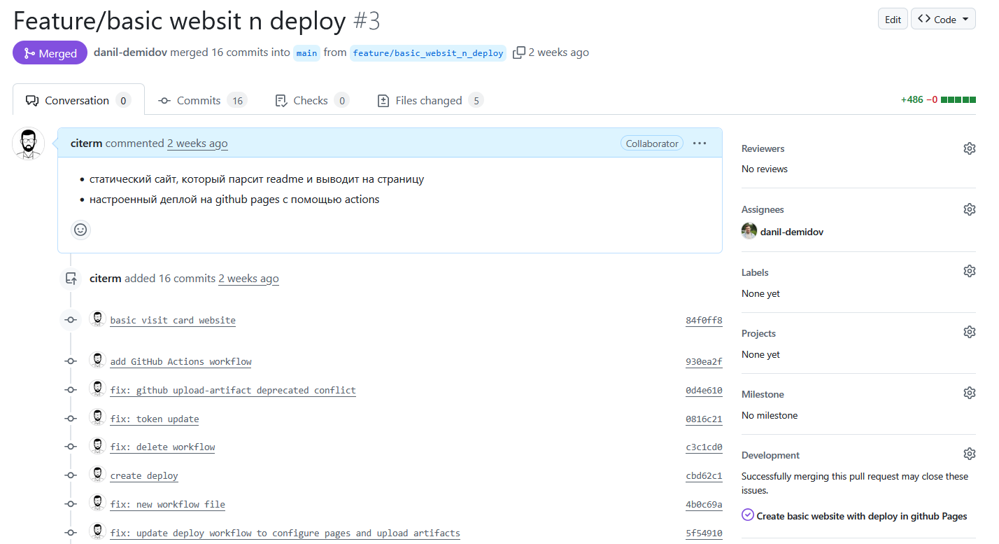
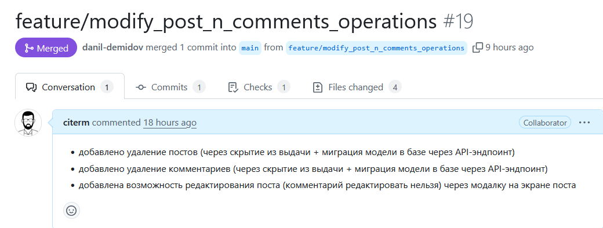

# Руководство по организации командного проекта на GitHub

## ЛР 3: Интеграция кода (First Integration)

### 1. Создание Pull Request для завершенных задач
- по завершению задачи ветку пушили и оформляли в PR 

### 2. Описание PR: что было сделано, скриншоты (если уместно)
- к каждому PR прикладывается описание 

### 3. Код-ревью: как минимум один другой участник команды должен проверить код и апрувить PR
- тимлид выполнял код ревью и апрувил PR

### 4. Мерж PR в ветку main/master после апрува
- после апрува происходил мерж ветки в main

### 5. Обновление доски: перемещение задачи в Done
- при апруве и мерже PR закрывал задачу автоматически (переводил в DONE)