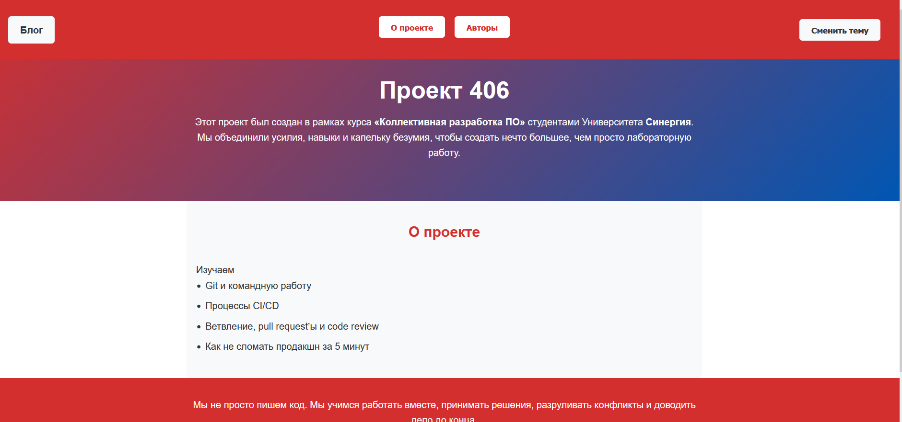
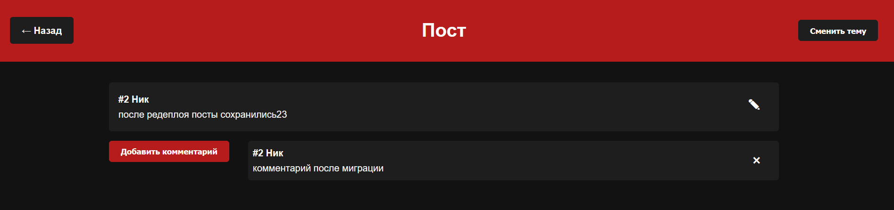

# Руководство по организации командного проекта на GitHub

## ЛР 4: Углубленная разработка и рефакторинг (Deep Dive)

### 1. Повторение цикла из Занятия 3: ветка -> разработка -> PR -> ревью -> мерж
- участник берет на себя задачу из колонки ToDo и переводит в IN PROGRESS
- делает fetch всех веток и pull main
- создает новую ветку от main
- делает коммиты
- push ветки
- создание PR через интерфейс github
- привязывание PR к задаче (для автозакрытия задачи после мержа)
- ждет апрува от тимлида
- мерж ветки в main и закрытие PR и перевод задачи в DONE

### 2. Решение конфликтов, которые неизбежно возникнут при мерже
- все конфликты и замечания решаются на этапе ревью PR
- каждое замечание оформляется в виде коммита в той же ветке и push ветки

### 3. Написание простых тестов или сценариев для ручного тестирования
- выбрали ручное тестирование
- список тест кейсов (пользователь может:)
    - увидеть описание проекта на главной странице 
    - нажать кнопку "авторы" и увидеть информацию об участниках 
    - нажать кнопку "о проекте" и увидеть описание проекта
    - нажать кнопку "сменить тему" и увидеть переключение на темную тему, если выбрана светлая 
    - нажать кнопку "сменить тему" и увидеть переключение на светлую тему, если выбрана темная
    - нажать кнопку "блог", перейти на экран блога и увидеть список постов 
    - нажать кнопку "создать пост", заполнить имя и текст в форме, нажать кнопку "сохранить" и увидеть новый пост в списке постов 
    - нажать кнопку "создать пост", заполнить имя и текст в форме, нажать кнопку "отмена" (крестик) и закрыть форму без создания поста
    - нажать кнопку "крестик" в блоке с текстом поста чтобы удалить его из списка (скрыть) 
    - нажать на блок текста поста, перейти на экран пост и увидеть полный текст поста и список комментариев к нему 
    - нажать кнопку "карандаш" в блоке с текстом поста, изменить имя и(или) текст в форме, нажать кнопку "сохранить" и увидеть обновленный пост 
    - нажать кнопку "карандаш" в блоке с текстом поста, изменить имя и(или) текст в форме, нажать кнопку "отмена" (крестик) и закрыть форму без обновления поста
    - нажать кнпоку "создать комментарий", заполнить имя и текст в форме, нажать кнопку "сохранить" и увидеть новый комментарий в списке комментариев 
    - нажать кнопку "создать комментарий", заполнить имя и текст в форме, нажать кнопку "отмена" (крестик) и закрыть форму без создания комментария
    - нажать кнопку "крестик" в блоке с текстом комментария чтобы удалить его из списка (скрыть) 

### 4. Рефакторинг: приведение кода к единому стилю, улучшение читаемости
- в процессе работы над проектом возник баг
    - решен в задаче https://github.com/danil-demidov/406/issues/15

### 5. Обновление README.md инструкцией по запуску и тестированию
- обновили readme
    - указали ресурс, где развернут проект
    - добавлен список use case (без скриншотов)
- для тестирования необходимо:
    - перейти по ссылке
    - пройти по use case из readme