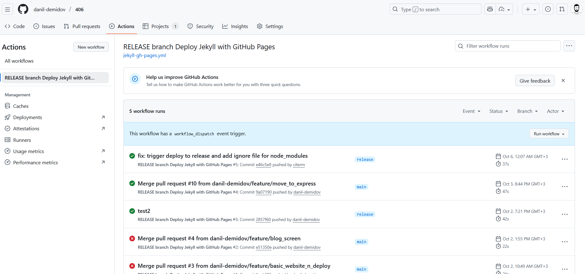
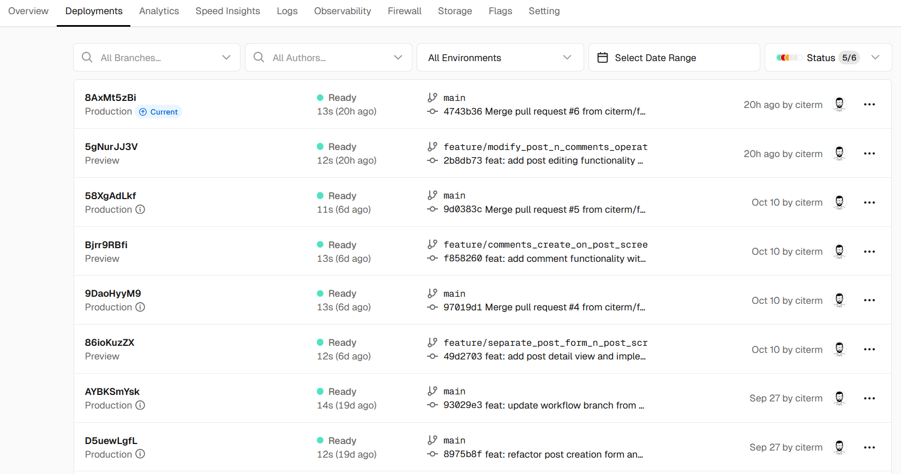
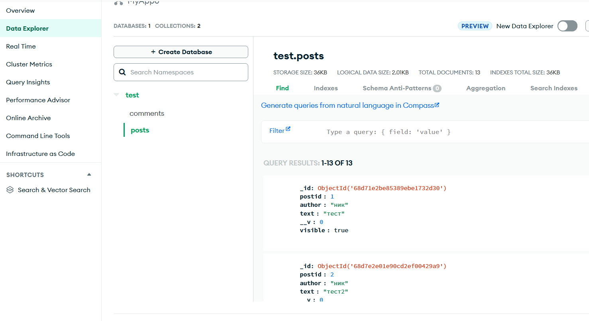

# Руководство по организации командного проекта на GitHub

## ЛР 5: Подготовка к релизу (Release Preparation)

### 1. Завершение всех задач из бэклога, кроме багов
- участники завершили все задачи

### 2. Создание тегов/релизов в Git (v1.0.0)
- приняли решение не использовать теги/релизы

### 3. Настройка базового CI/CD (например, GitHub Action для запуска тестов или деплоя на GitHub Pages)
- статическую часть сайта развернули через GitHub Actions 
- после перехода на Express.js + MongoDB
    - серверная часть развернута в vercel (https://vercel.com) 
    - база данных развернута в mongoDB Atlas (https://cloud.mongodb.com/) 

### 4. Финальное тестирование всего приложения
- в процессе полного тестирования по use case из readme
    - баги не выявлены

### 5. Создание финальной версии README.md с описанием проекта, скриншотами, инструкцией по установке и запуску
- приняли решение не использовать скриншоты (сайт маленький по функционалу и интуитивно понятный - инструкция не требуется)
- README.md дополнен инструкцией по установке и запуску