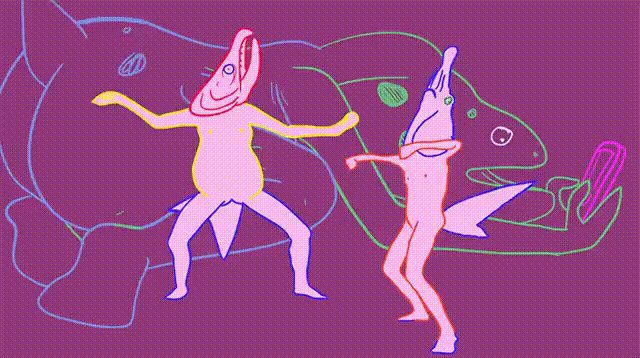
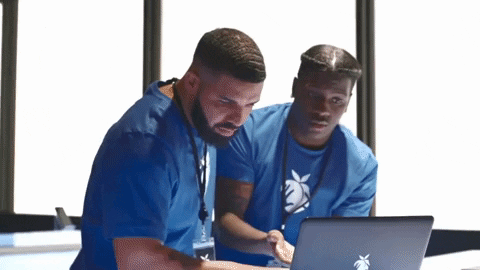
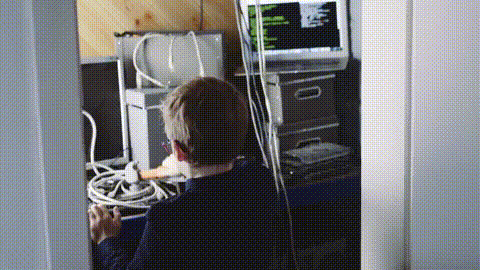

# Мы решили запилить общий отчёт проекта "Блог"

## Я Данил и я отвечаю за DevOps, тестирование, CI/CD и мемы


## Занятие 1  

### Планирование и старт

Начали, как водится, с пустоты. Я первым делом завёл репозиторий:  
[github.com/danil-demidov/406](https://github.com/danil-demidov/406)

Добавил `.gitignore`, черканул `README.md`, чтобы не забыть, зачем всё это вообще затеяли, и что у нас за стек.
Потом накатал канбан-доску в GitHub Projects — без неё быстро бы утонули.  
Накидал туда тикеты вроде «создать структуру проекта» и «инициализировать окружение».  
Короче, запустили движуху. Было ощущение, что процесс пошёл.

---

## Занятие 2  

### Разработка ядра

Подключил репозиторий к себе, открыл ветку `feature/devops-config` и пошёл копать.  
Коммиты шли ровно, без суеты. Примерно так:

```
feat: add basic project setup
chore: init gitignore and readme
```

Следил, чтобы никто не принёс бардак.  
Всё должно собираться одинаково, а не «у меня работает».  
Если честно — люблю, когда всё аккуратно и предсказуемо.
Даже скучно немного, но зато спишь спокойно.

---

## Занятие 3  

### Интеграция

Пошли Pull Request’ы.  
Я проверял, что Никита наделал, комментировал, запускал локально, если что-то не сходилось.  
После правок принимал, мержил в `main`, двигал карточки на доске.  
Жизнь проекта — тикет, код, ревью, done.  
Никаких чудес, но приятно, когда система работает как часы.

---

## Занятие 4  

### Рефакторинг и чистка

Дошёл до того этапа, когда всё вроде работает, но что-то зудит.  
Пошёл проверять интерфейс, ловить мелочи.  
Поправил пару странных моментов, переписал куски, которые могли отвалиться при кривом вводе.  
В `README.md` дописал пару строк, чтобы новый человек не тратил вечер на «почему не запускается».  
Теперь можно хотя бы передавать проект без страха.

---

## Занятие 5  

### Завершаем и шлифуем

Настроил GitHub Pages, проверил, что всё собирается и блог реально открывается.  
Без фанатизма — просто убедился, что ничего не горит.  
Всё работало стабильно, даже подозрительно.  
Когда система не падает, всегда немного не по себе, будто что-то пропустил.

---

## Занятие 6  

### Демонстрация и ретроспектива

Показали блог.  
Посты создаются, всё кликается, граф активности на GitHub живёт своей жизнью.  
*Insights → Graph* — там даже красивые линии.



На ретроспективе сказал просто:  
работали спокойно, без драм, каждый делал своё.  
Если не будет лень <!-- конечно будет --> надо встроить автотесты и пожёстче настроить CI — чтобы коммиты не проходили мимо фильтра.  
А то уж больно всё гладко шло.

---

# Я Никита, и я отвечаю за архитектуру, фронтенд и делаю так, чтобы всё хотя бы как-то выглядело

## Занятие 1  

### Планирование и старт

Идея была простая: сделать блог, где можно создавать, читать и удалять посты.  
CRUD, да, банально — но зато понятно, с чего начинать.  
Оформили задачи на доске, договорились, кто за что отвечает.  
Я взял на себя архитектуру и фронт.  
`lab_1_plan_1_2.md` — наш первый черновик.  
На тот момент он выглядел скромно, но хоть какая-то структура уже была.

---

## Занятие 2  

### Разработка ядра

Начал собирать каркас.  
Сделал страницы, формы, стили — без фанатизма, но чтобы не стыдно было открыть в браузере.  
Роутинг между страницами, обработка форм, немного валидации.  
Коммиты шли в духе:

```
feat: add create post form
refactor: separate layout
```

С каждым коммитом код становился чуть менее страшным.  
Иногда просто радовался, что ничего не сломалось.

---

## Занятие 3  

### Интеграция

Создал Pull Request — Данил посмотрел, покомментировал, местами подправил.
После ревью всё соединили, проверили в браузере и даже на телефоне (чтобы не стыдно было показать).



Интерфейс ожил: кнопки кликаются, посты появляются.
В такие моменты чувствуешь, что код — это не просто текст, а что-то живое.

---

## Занятие 4  

### Шлифовка



Начал приводить всё к уму.
Добавил удаление постов, проверку заполненности форм, выкинул дублирующийся код.
Сделал так, чтобы интерфейс не психовал при пустом вводе.
`lab_3_plan_4.md` — там видно, сколько мелочей было переделано.
Когда наконец заработало без костылей — просто выдохнул.

---

## Занятие 5  

### Финальная сборка

Прошёлся по всему проекту: поправил стили, чуть подровнял верстку, проверил логику.
Посты добавляются, всё выглядит прилично.
Подключил GitHub Pages вместе с Данилом — и всё, блог пошёл в интернет.
Приятно, когда можешь просто открыть вкладку и увидеть свой труд вживую.


---

## Занятие 6  

### Демонстрация и ретроспектива

На демо показали весь процесс: создаём пост, вводим текст, нажимаем — и он уже в списке.
Работает без шаманства.
Примерно так:

```
form → postList
input.onchange → state update
```

На обсуждении признался: hardest part — поведение формы и структура HTML.
Они всегда притворяются простыми, пока не начнёшь делать по-честному.
В целом всё шло ровно, ревью быстрое, работа спокойная.
В следующий раз хочу добавить автоматические проверки интерфейса, чтобы не ловить баги вручную.
А ещё — чуть больше кофе и чуть меньше перфекционизма.


